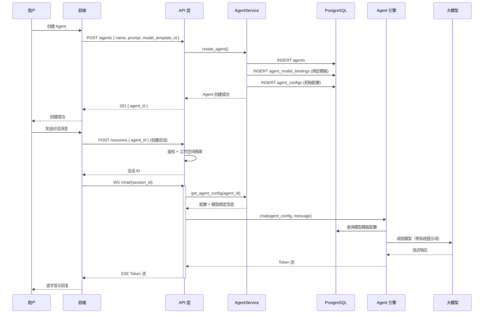
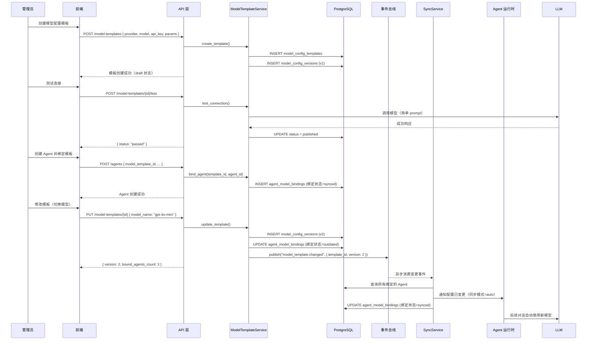
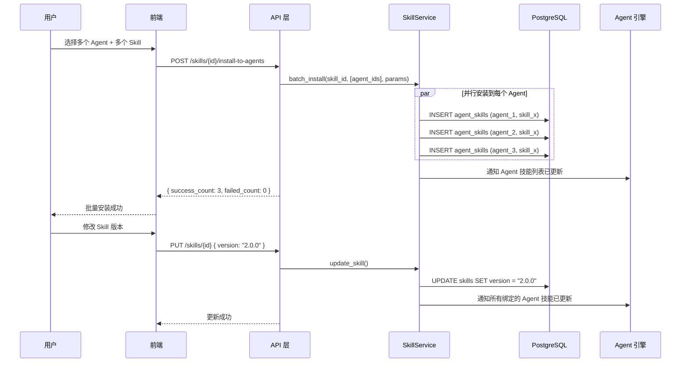
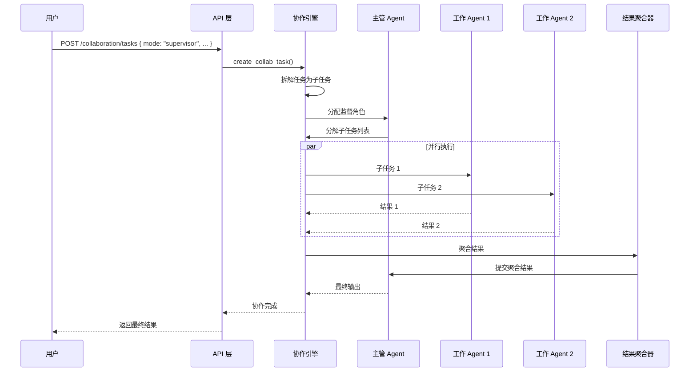
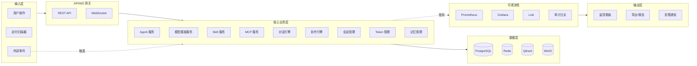

# 业务数据流图

> 配套文档：智能体管理系统构建计划书 v1.7 — 第9章
> 涵盖核心业务流程的数据流与事件流

---

## 1. 核心链路一：创建 Agent → 对话

---

## 2. 核心链路二：模型配置模板 → 一键绑定 → 自动同步

---

## 3. 核心链路三：Skill 批量安装 → 跨 Agent 同步

---

## 4. 核心链路四：多 Agent 协作

---

## 5. 数据流总图

---

## 6. 事件总线事件列表

| 事件名称 | 发布时机 | 消费者 |
|---------|---------|--------|
| agent.created | Agent 创建后 | 审计服务、扫描器 |
| agent.deleted | Agent 删除后 | 会话服务、记忆服务 |
| agent.status_changed | Agent 状态变更 | 监控服务、看板 |
| model_template.created | 模板创建后 | 审计服务 |
| model_template.updated | 模板更新后 | 同步服务、绑定 Agent |
| model_template.synced | 同步完成后 | 审计服务 |
| skill.installed | Skill 安装后 | Agent 引擎 |
| skill.updated | Skill 更新后 | 绑定 Agent |
| skill.uninstalled | Skill 卸载后 | Agent 引擎 |
| mcp.registered | MCP 注册后 | Agent 引擎 |
| session.created | 会话创建 | Token 服务 |
| message.sent | 消息发送 | Token 服务、记忆服务 |
| backup.completed | 备份完成 | 监控服务 |
| health.alert | 健康检查异常 | 告警服务、看板 |
| scanner.found_changes | 扫描到变更 | 更新中心 |

---

> **文件版本：** v1.0 | **更新日期：** 2026-07-26
