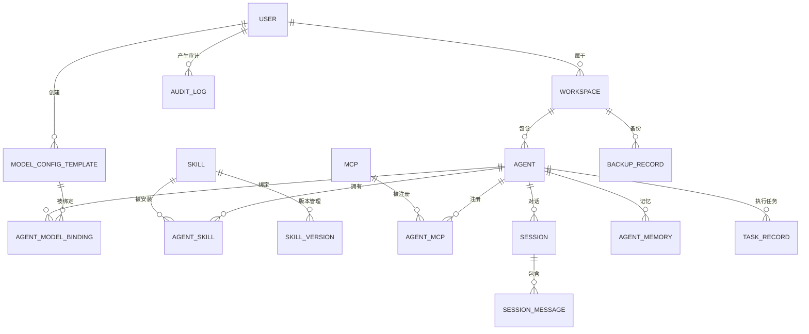

# 数据库表结构设计

> 配套文档：智能体管理系统构建计划书 v1.7 — 第9章
> 设计目标：覆盖全部25个功能模块的数据存储需求

---

## 1. ER 图概览



---

## 2. 核心表结构

### 2.1 用户与工作空间

#### users（用户表）

| 字段名 | 类型 | 约束 | 说明 |
|--------|------|------|------|
| id | UUID | PK, DEFAULT gen_random_uuid() | 主键 |
| username | VARCHAR(64) | UNIQUE, NOT NULL | 用户名 |
| email | VARCHAR(255) | UNIQUE | 邮箱 |
| password_hash | VARCHAR(255) | NOT NULL | 密码哈希 |
| display_name | VARCHAR(128) | | 显示名称 |
| status | SMALLINT | DEFAULT 1 | 0-禁用 1-正常 |
| role | VARCHAR(32) | DEFAULT 'user' | admin/user/viewer |
| last_login_at | TIMESTAMPTZ | | 最后登录时间 |
| created_at | TIMESTAMPTZ | DEFAULT now() | |
| updated_at | TIMESTAMPTZ | DEFAULT now() | |

```sql
CREATE TABLE users (
    id UUID PRIMARY KEY DEFAULT gen_random_uuid(),
    username VARCHAR(64) NOT NULL UNIQUE,
    email VARCHAR(255) UNIQUE,
    password_hash VARCHAR(255) NOT NULL,
    display_name VARCHAR(128),
    status SMALLINT DEFAULT 1,
    role VARCHAR(32) DEFAULT 'user',
    last_login_at TIMESTAMPTZ,
    created_at TIMESTAMPTZ DEFAULT now(),
    updated_at TIMESTAMPTZ DEFAULT now()
);
CREATE INDEX idx_users_email ON users(email);
CREATE INDEX idx_users_status ON users(status);
```

#### workspaces（工作空间表）

| 字段名 | 类型 | 约束 | 说明 |
|--------|------|------|------|
| id | UUID | PK | |
| name | VARCHAR(128) | NOT NULL | 空间名称 |
| owner_id | UUID | FK→users.id | 所有者 |
| description | TEXT | | |
| max_agents | INT | DEFAULT 50 | Agent 上限 |
| storage_quota_bytes | BIGINT | DEFAULT 10737418240 | 10GB |
| is_active | BOOLEAN | DEFAULT true | |
| created_at | TIMESTAMPTZ | | |
| updated_at | TIMESTAMPTZ | | |

```sql
CREATE TABLE workspaces (
    id UUID PRIMARY KEY DEFAULT gen_random_uuid(),
    name VARCHAR(128) NOT NULL,
    owner_id UUID NOT NULL REFERENCES users(id),
    description TEXT,
    max_agents INT DEFAULT 50,
    storage_quota_bytes BIGINT DEFAULT 10737418240,
    is_active BOOLEAN DEFAULT true,
    created_at TIMESTAMPTZ DEFAULT now(),
    updated_at TIMESTAMPTZ DEFAULT now()
);
CREATE INDEX idx_workspaces_owner ON workspaces(owner_id);
```

---

### 2.2 智能体管理

#### agents（智能体表）

| 字段名 | 类型 | 约束 | 说明 |
|--------|------|------|------|
| id | UUID | PK | |
| workspace_id | UUID | FK→workspaces.id | 所属空间 |
| name | VARCHAR(128) | NOT NULL | Agent 名称 |
| agent_type | VARCHAR(32) | DEFAULT 'custom' | custom/template/builtin |
| status | VARCHAR(20) | DEFAULT 'inactive' | inactive/active/error |
| system_prompt | TEXT | | 系统提示词 |
| description | TEXT | | |
| avatar_url | VARCHAR(512) | | 头像 |
| version | INT | DEFAULT 1 | 配置版本号 |
| metadata | JSONB | DEFAULT '{}' | 扩展属性 |
| created_at | TIMESTAMPTZ | | |
| updated_at | TIMESTAMPTZ | | |

```sql
CREATE TABLE agents (
    id UUID PRIMARY KEY DEFAULT gen_random_uuid(),
    workspace_id UUID NOT NULL REFERENCES workspaces(id) ON DELETE CASCADE,
    name VARCHAR(128) NOT NULL,
    agent_type VARCHAR(32) DEFAULT 'custom',
    status VARCHAR(20) DEFAULT 'inactive',
    system_prompt TEXT,
    description TEXT,
    avatar_url VARCHAR(512),
    version INT DEFAULT 1,
    metadata JSONB DEFAULT '{}',
    created_at TIMESTAMPTZ DEFAULT now(),
    updated_at TIMESTAMPTZ DEFAULT now()
);
CREATE INDEX idx_agents_workspace ON agents(workspace_id);
CREATE INDEX idx_agents_status ON agents(status);
```

#### agent_configs（智能体配置表 — 支持多版本）

| 字段名 | 类型 | 约束 | 说明 |
|--------|------|------|------|
| id | UUID | PK | |
| agent_id | UUID | FK→agents.id | |
| version | INT | NOT NULL | 配置版本号 |
| temperature | DECIMAL(3,2) | DEFAULT 0.7 | |
| max_tokens | INT | DEFAULT 2048 | |
| top_p | DECIMAL(3,2) | DEFAULT 0.9 | |
| model_params | JSONB | DEFAULT '{}' | 扩展参数 |
| output_format | VARCHAR(32) | DEFAULT 'text' | text/json/markdown |
| tools_enabled | JSONB | DEFAULT '[]' | 启用工具列表 |
| created_at | TIMESTAMPTZ | | |

```sql
CREATE TABLE agent_configs (
    id UUID PRIMARY KEY DEFAULT gen_random_uuid(),
    agent_id UUID NOT NULL REFERENCES agents(id) ON DELETE CASCADE,
    version INT NOT NULL,
    temperature DECIMAL(3,2) DEFAULT 0.7,
    max_tokens INT DEFAULT 2048,
    top_p DECIMAL(3,2) DEFAULT 0.9,
    model_params JSONB DEFAULT '{}',
    output_format VARCHAR(32) DEFAULT 'text',
    tools_enabled JSONB DEFAULT '[]',
    created_at TIMESTAMPTZ DEFAULT now(),
    UNIQUE(agent_id, version)
);
CREATE INDEX idx_agent_configs_agent ON agent_configs(agent_id);
```

---

### 2.3 模型配置模板与绑定

#### model_config_templates（模型配置模板表）

| 字段名 | 类型 | 约束 | 说明 |
|--------|------|------|------|
| id | UUID | PK | |
| workspace_id | UUID | FK→workspaces.id | |
| name | VARCHAR(128) | NOT NULL | 模板名称 |
| provider | VARCHAR(64) | NOT NULL | Provider 类型：ollama/openai/azure/anthropic/deepseek |
| model_name | VARCHAR(128) | NOT NULL | 模型名称 |
| api_base_url | VARCHAR(512) | | Endpoint URL |
| api_key | VARCHAR(512) | ENCRYPTED | 加密存储的 API Key |
| default_params | JSONB | DEFAULT '{}' | 默认参数（temperature/max_tokens/top_p等） |
| category | VARCHAR(64) | | 分类标签：对话/嵌入/代码/图像 |
| status | VARCHAR(20) | DEFAULT 'draft' | draft/published/deprecated |
| version | INT | DEFAULT 1 | 当前版本号 |
| test_status | VARCHAR(20) | | untested/passed/failed |
| created_by | UUID | FK→users.id | |
| created_at | TIMESTAMPTZ | | |
| updated_at | TIMESTAMPTZ | | |

```sql
CREATE TABLE model_config_templates (
    id UUID PRIMARY KEY DEFAULT gen_random_uuid(),
    workspace_id UUID NOT NULL REFERENCES workspaces(id) ON DELETE CASCADE,
    name VARCHAR(128) NOT NULL,
    provider VARCHAR(64) NOT NULL,
    model_name VARCHAR(128) NOT NULL,
    api_base_url VARCHAR(512),
    api_key VARCHAR(512),
    default_params JSONB DEFAULT '{}',
    category VARCHAR(64),
    status VARCHAR(20) DEFAULT 'draft',
    version INT DEFAULT 1,
    test_status VARCHAR(20) DEFAULT 'untested',
    created_by UUID REFERENCES users(id),
    created_at TIMESTAMPTZ DEFAULT now(),
    updated_at TIMESTAMPTZ DEFAULT now()
);
CREATE INDEX idx_mct_workspace ON model_config_templates(workspace_id);
CREATE INDEX idx_mct_status ON model_config_templates(status);
CREATE INDEX idx_mct_category ON model_config_templates(category);
```

#### model_config_versions（模型配置版本表）

| 字段名 | 类型 | 约束 | 说明 |
|--------|------|------|------|
| id | UUID | PK | |
| template_id | UUID | FK→model_config_templates.id | |
| version | INT | NOT NULL | 版本号 |
| config_snapshot | JSONB | NOT NULL | 配置快照（完整JSON） |
| changelog | TEXT | | 变更说明 |
| created_by | UUID | FK→users.id | |
| created_at | TIMESTAMPTZ | | |

```sql
CREATE TABLE model_config_versions (
    id UUID PRIMARY KEY DEFAULT gen_random_uuid(),
    template_id UUID NOT NULL REFERENCES model_config_templates(id) ON DELETE CASCADE,
    version INT NOT NULL,
    config_snapshot JSONB NOT NULL,
    changelog TEXT,
    created_by UUID REFERENCES users(id),
    created_at TIMESTAMPTZ DEFAULT now(),
    UNIQUE(template_id, version)
);
```

#### agent_model_bindings（Agent 模型绑定表）

| 字段名 | 类型 | 约束 | 说明 |
|--------|------|------|------|
| id | UUID | PK | |
| agent_id | UUID | FK→agents.id | |
| template_id | UUID | FK→model_config_templates.id | |
| template_version | INT | NOT NULL | 绑定的模板版本 |
| override_params | JSONB | DEFAULT '{}' | 参数覆盖（如{"temperature": 0.1}） |
| sync_mode | VARCHAR(20) | DEFAULT 'auto' | auto/manual — 模板变更时同步方式 |
| binding_status | VARCHAR(20) | DEFAULT 'synced' | synced/outdated/pending |
| created_at | TIMESTAMPTZ | | |
| updated_at | TIMESTAMPTZ | | |

```sql
CREATE TABLE agent_model_bindings (
    id UUID PRIMARY KEY DEFAULT gen_random_uuid(),
    agent_id UUID NOT NULL REFERENCES agents(id) ON DELETE CASCADE,
    template_id UUID NOT NULL REFERENCES model_config_templates(id) ON DELETE RESTRICT,
    template_version INT NOT NULL,
    override_params JSONB DEFAULT '{}',
    sync_mode VARCHAR(20) DEFAULT 'auto',
    binding_status VARCHAR(20) DEFAULT 'synced',
    created_at TIMESTAMPTZ DEFAULT now(),
    updated_at TIMESTAMPTZ DEFAULT now(),
    UNIQUE(agent_id, template_id)
);
CREATE INDEX idx_amb_agent ON agent_model_bindings(agent_id);
CREATE INDEX idx_amb_template ON agent_model_bindings(template_id);
CREATE INDEX idx_amb_status ON agent_model_bindings(binding_status);
```

---

### 2.4 Skill 体系

#### skills（技能表）

| 字段名 | 类型 | 约束 | 说明 |
|--------|------|------|------|
| id | UUID | PK | |
| workspace_id | UUID | FK→workspaces.id | |
| name | VARCHAR(128) | NOT NULL | 技能名称 |
| skill_type | VARCHAR(32) | | builtin/custom/market |
| version | VARCHAR(20) | NOT NULL | SemVer 版本号 |
| description | TEXT | | |
| entry_point | VARCHAR(256) | | 入口文件/函数 |
| dependencies | JSONB | DEFAULT '[]' | 依赖列表 |
| tags | TEXT[] | | 标签数组 |
| author | VARCHAR(128) | | |
| is_active | BOOLEAN | DEFAULT true | |
| created_at | TIMESTAMPTZ | | |
| updated_at | TIMESTAMPTZ | | |

```sql
CREATE TABLE skills (
    id UUID PRIMARY KEY DEFAULT gen_random_uuid(),
    workspace_id UUID REFERENCES workspaces(id) ON DELETE CASCADE,
    name VARCHAR(128) NOT NULL,
    skill_type VARCHAR(32) DEFAULT 'custom',
    version VARCHAR(20) NOT NULL,
    description TEXT,
    entry_point VARCHAR(256),
    dependencies JSONB DEFAULT '[]',
    tags TEXT[],
    author VARCHAR(128),
    is_active BOOLEAN DEFAULT true,
    created_at TIMESTAMPTZ DEFAULT now(),
    updated_at TIMESTAMPTZ DEFAULT now()
);
CREATE INDEX idx_skills_workspace ON skills(workspace_id);
CREATE INDEX idx_skills_type ON skills(skill_type);
```

#### agent_skills（Agent-Skill 关联表）

| 字段名 | 类型 | 约束 | 说明 |
|--------|------|------|------|
| id | UUID | PK | |
| agent_id | UUID | FK→agents.id | |
| skill_id | UUID | FK→skills.id | |
| params | JSONB | DEFAULT '{}' | 技能参数 |
| priority | INT | DEFAULT 0 | 优先级 |
| is_enabled | BOOLEAN | DEFAULT true | |
| installed_at | TIMESTAMPTZ | | |
| UNIQUE(agent_id, skill_id) | | | |

```sql
CREATE TABLE agent_skills (
    id UUID PRIMARY KEY DEFAULT gen_random_uuid(),
    agent_id UUID NOT NULL REFERENCES agents(id) ON DELETE CASCADE,
    skill_id UUID NOT NULL REFERENCES skills(id) ON DELETE CASCADE,
    params JSONB DEFAULT '{}',
    priority INT DEFAULT 0,
    is_enabled BOOLEAN DEFAULT true,
    installed_at TIMESTAMPTZ DEFAULT now(),
    UNIQUE(agent_id, skill_id)
);
CREATE INDEX idx_agent_skills_agent ON agent_skills(agent_id);
```

---

### 2.5 MCP 管理

#### mcps（MCP 工具表）

| 字段名 | 类型 | 约束 | 说明 |
|--------|------|------|------|
| id | UUID | PK | |
| workspace_id | UUID | FK→workspaces.id | |
| name | VARCHAR(128) | NOT NULL | 工具名称 |
| mcp_type | VARCHAR(32) | | builtin/custom/public |
| protocol | VARCHAR(16) | DEFAULT 'stdio' | stdio/sse/websocket |
| command | VARCHAR(512) | | stdio 模式命令 |
| url | VARCHAR(512) | | sse/websocket URL |
| env_vars | JSONB | DEFAULT '{}' | 环境变量 |
| schema | JSONB | | 工具定义 Schema |
| version | VARCHAR(20) | | |
| is_active | BOOLEAN | DEFAULT true | |
| created_at | TIMESTAMPTZ | | |
| updated_at | TIMESTAMPTZ | | |

```sql
CREATE TABLE mcps (
    id UUID PRIMARY KEY DEFAULT gen_random_uuid(),
    workspace_id UUID REFERENCES workspaces(id) ON DELETE CASCADE,
    name VARCHAR(128) NOT NULL,
    mcp_type VARCHAR(32) DEFAULT 'custom',
    protocol VARCHAR(16) DEFAULT 'stdio',
    command VARCHAR(512),
    url VARCHAR(512),
    env_vars JSONB DEFAULT '{}',
    schema JSONB,
    version VARCHAR(20),
    is_active BOOLEAN DEFAULT true,
    created_at TIMESTAMPTZ DEFAULT now(),
    updated_at TIMESTAMPTZ DEFAULT now()
);
```

#### agent_mcps（Agent-MCP 关联表）

| 字段名 | 类型 | 约束 | 说明 |
|--------|------|------|------|
| id | UUID | PK | |
| agent_id | UUID | FK→agents.id | |
| mcp_id | UUID | FK→mcps.id | |
| params | JSONB | DEFAULT '{}' | 调用参数 |
| is_enabled | BOOLEAN | DEFAULT true | |
| created_at | TIMESTAMPTZ | | |
| UNIQUE(agent_id, mcp_id) | | | |

```sql
CREATE TABLE agent_mcps (
    id UUID PRIMARY KEY DEFAULT gen_random_uuid(),
    agent_id UUID NOT NULL REFERENCES agents(id) ON DELETE CASCADE,
    mcp_id UUID NOT NULL REFERENCES mcps(id) ON DELETE CASCADE,
    params JSONB DEFAULT '{}',
    is_enabled BOOLEAN DEFAULT true,
    created_at TIMESTAMPTZ DEFAULT now(),
    UNIQUE(agent_id, mcp_id)
);
```

---

### 2.6 会话与消息

#### sessions（会话表）

| 字段名 | 类型 | 约束 | 说明 |
|--------|------|------|------|
| id | UUID | PK | |
| agent_id | UUID | FK→agents.id | |
| workspace_id | UUID | FK→workspaces.id | |
| title | VARCHAR(256) | | 会话标题 |
| status | VARCHAR(20) | DEFAULT 'active' | active/archived/closed |
| session_type | VARCHAR(20) | DEFAULT 'single' | single/multi/collaboration |
| context_json | JSONB | DEFAULT '{}' | 上下文快照 |
| token_count | INT | DEFAULT 0 | 累计 Token |
| storage_tier | VARCHAR(10) | DEFAULT 'hot' | hot/warm/cold |
| created_at | TIMESTAMPTZ | | |
| updated_at | TIMESTAMPTZ | | |
| expired_at | TIMESTAMPTZ | | 过期时间 |

```sql
CREATE TABLE sessions (
    id UUID PRIMARY KEY DEFAULT gen_random_uuid(),
    agent_id UUID NOT NULL REFERENCES agents(id) ON DELETE CASCADE,
    workspace_id UUID REFERENCES workspaces(id),
    title VARCHAR(256),
    status VARCHAR(20) DEFAULT 'active',
    session_type VARCHAR(20) DEFAULT 'single',
    context_json JSONB DEFAULT '{}',
    token_count INT DEFAULT 0,
    storage_tier VARCHAR(10) DEFAULT 'hot',
    created_at TIMESTAMPTZ DEFAULT now(),
    updated_at TIMESTAMPTZ DEFAULT now(),
    expired_at TIMESTAMPTZ
);
CREATE INDEX idx_sessions_agent ON sessions(agent_id);
CREATE INDEX idx_sessions_status ON sessions(status);
CREATE INDEX idx_sessions_created ON sessions(created_at);
```

#### session_messages（消息表）

| 字段名 | 类型 | 约束 | 说明 |
|--------|------|------|------|
| id | UUID | PK | |
| session_id | UUID | FK→sessions.id | |
| role | VARCHAR(20) | NOT NULL | user/assistant/system/tool |
| content | TEXT | NOT NULL | 消息内容 |
| content_type | VARCHAR(32) | DEFAULT 'text' | text/markdown/code/image/file |
| tool_calls | JSONB | | 工具调用记录 |
| token_count | INT | | 本条 Token |
| model_used | VARCHAR(64) | | 使用的模型 |
| latency_ms | INT | | 响应延迟 |
| message_meta | JSONB | DEFAULT '{}' | 扩展元数据 |
| created_at | TIMESTAMPTZ | | |

```sql
CREATE TABLE session_messages (
    id UUID PRIMARY KEY DEFAULT gen_random_uuid(),
    session_id UUID NOT NULL REFERENCES sessions(id) ON DELETE CASCADE,
    role VARCHAR(20) NOT NULL,
    content TEXT NOT NULL,
    content_type VARCHAR(32) DEFAULT 'text',
    tool_calls JSONB,
    token_count INT,
    model_used VARCHAR(64),
    latency_ms INT,
    message_meta JSONB DEFAULT '{}',
    created_at TIMESTAMPTZ DEFAULT now()
);
CREATE INDEX idx_messages_session ON session_messages(session_id);
CREATE INDEX idx_messages_created ON session_messages(created_at);
```

---

### 2.7 Token 管理

#### token_usage（Token 消耗表）

| 字段名 | 类型 | 约束 | 说明 |
|--------|------|------|------|
| id | BIGSERIAL | PK | |
| workspace_id | UUID | FK→workspaces.id | |
| agent_id | UUID | FK→agents.id | |
| session_id | UUID | FK→sessions.id | |
| model_name | VARCHAR(128) | NOT NULL | |
| input_tokens | INT | DEFAULT 0 | |
| output_tokens | INT | DEFAULT 0 | |
| cached_tokens | INT | DEFAULT 0 | |
| cost | DECIMAL(10,6) | DEFAULT 0 | 估算成本 |
| recorded_at | TIMESTAMPTZ | DEFAULT now() | |

```sql
CREATE TABLE token_usage (
    id BIGSERIAL PRIMARY KEY,
    workspace_id UUID REFERENCES workspaces(id),
    agent_id UUID REFERENCES agents(id),
    session_id UUID REFERENCES sessions(id),
    model_name VARCHAR(128) NOT NULL,
    input_tokens INT DEFAULT 0,
    output_tokens INT DEFAULT 0,
    cached_tokens INT DEFAULT 0,
    cost DECIMAL(10,6) DEFAULT 0,
    recorded_at TIMESTAMPTZ DEFAULT now()
);
CREATE INDEX idx_token_workspace ON token_usage(workspace_id);
CREATE INDEX idx_token_agent ON token_usage(agent_id);
CREATE INDEX idx_token_recorded ON token_usage(recorded_at);
-- 按月分区
CREATE TABLE token_usage_202607 PARTITION OF token_usage
    FOR VALUES FROM ('2026-07-01') TO ('2026-08-01');
```

---

### 2.8 审计日志

#### audit_logs（审计日志表 — 分区表）

| 字段名 | 类型 | 约束 | 说明 |
|--------|------|------|------|
| id | BIGSERIAL | PK | |
| workspace_id | UUID | FK→workspaces.id | |
| user_id | UUID | FK→users.id | |
| agent_id | UUID | | 涉及 Agent |
| action | VARCHAR(64) | NOT NULL | 操作类型 |
| resource_type | VARCHAR(32) | NOT NULL | agent/skill/mcp/config/auth |
| resource_id | VARCHAR(128) | | 资源 ID |
| detail | JSONB | | 操作详情（变更前后） |
| ip_address | INET | | |
| user_agent | VARCHAR(512) | | |
| prev_hash | VARCHAR(64) | | 上一条记录哈希 |
| curr_hash | VARCHAR(64) | NOT NULL | 本条哈希链 |
| recorded_at | TIMESTAMPTZ | DEFAULT now() | |

```sql
CREATE TABLE audit_logs (
    id BIGSERIAL,
    workspace_id UUID REFERENCES workspaces(id),
    user_id UUID REFERENCES users(id),
    agent_id UUID,
    action VARCHAR(64) NOT NULL,
    resource_type VARCHAR(32) NOT NULL,
    resource_id VARCHAR(128),
    detail JSONB,
    ip_address INET,
    user_agent VARCHAR(512),
    prev_hash VARCHAR(64),
    curr_hash VARCHAR(64) NOT NULL,
    recorded_at TIMESTAMPTZ DEFAULT now(),
    PRIMARY KEY (id, recorded_at)
) PARTITION BY RANGE (recorded_at);

CREATE INDEX idx_audit_workspace ON audit_logs(workspace_id);
CREATE INDEX idx_audit_action ON audit_logs(action);
CREATE INDEX idx_audit_recorded ON audit_logs(recorded_at);
```

---

### 2.9 Agent 记忆

#### agent_memories（Agent 记忆表）

| 字段名 | 类型 | 约束 | 说明 |
|--------|------|------|------|
| id | UUID | PK | |
| agent_id | UUID | FK→agents.id | |
| memory_type | VARCHAR(20) | NOT NULL | episodic/semantic/procedural |
| content | TEXT | NOT NULL | 记忆内容 |
| embedding | vector(1536) | | 向量嵌入 |
| importance | DECIMAL(3,2) | DEFAULT 0.5 | 重要性评分 |
| source | VARCHAR(64) | | 来源 |
| access_count | INT | DEFAULT 0 | 访问次数 |
| last_accessed_at | TIMESTAMPTZ | | |
| is_sensitive | BOOLEAN | DEFAULT false | 敏感标记 |
| created_at | TIMESTAMPTZ | | |
| expired_at | TIMESTAMPTZ | | 遗忘时间 |

```sql
CREATE TABLE agent_memories (
    id UUID PRIMARY KEY DEFAULT gen_random_uuid(),
    agent_id UUID NOT NULL REFERENCES agents(id) ON DELETE CASCADE,
    memory_type VARCHAR(20) NOT NULL,
    content TEXT NOT NULL,
    embedding vector(1536),
    importance DECIMAL(3,2) DEFAULT 0.5,
    source VARCHAR(64),
    access_count INT DEFAULT 0,
    last_accessed_at TIMESTAMPTZ,
    is_sensitive BOOLEAN DEFAULT false,
    created_at TIMESTAMPTZ DEFAULT now(),
    expired_at TIMESTAMPTZ
);
CREATE INDEX idx_memories_agent ON agent_memories(agent_id);
CREATE INDEX idx_memories_type ON agent_memories(memory_type);
CREATE INDEX idx_memories_importance ON agent_memories(importance DESC);
```

---

### 2.10 备份与监控

#### backup_records（备份记录表）

| 字段名 | 类型 | 约束 | 说明 |
|--------|------|------|------|
| id | UUID | PK | |
| workspace_id | UUID | FK→workspaces.id | |
| backup_type | VARCHAR(20) | NOT NULL | full/incremental/event |
| status | VARCHAR(20) | | running/completed/failed |
| size_bytes | BIGINT | | 备份大小 |
| file_path | VARCHAR(512) | | 存储路径 |
| checksum | VARCHAR(64) | | SHA-256 校验和 |
| encrypted | BOOLEAN | DEFAULT false | |
| included_components | JSONB | | 包含组件列表 |
| started_at | TIMESTAMPTZ | | |
| completed_at | TIMESTAMPTZ | | |
| created_at | TIMESTAMPTZ | | |

```sql
CREATE TABLE backup_records (
    id UUID PRIMARY KEY DEFAULT gen_random_uuid(),
    workspace_id UUID REFERENCES workspaces(id) ON DELETE CASCADE,
    backup_type VARCHAR(20) NOT NULL,
    status VARCHAR(20) DEFAULT 'running',
    size_bytes BIGINT,
    file_path VARCHAR(512),
    checksum VARCHAR(64),
    encrypted BOOLEAN DEFAULT false,
    included_components JSONB,
    started_at TIMESTAMPTZ,
    completed_at TIMESTAMPTZ,
    created_at TIMESTAMPTZ DEFAULT now()
);
CREATE INDEX idx_backup_workspace ON backup_records(workspace_id);
CREATE INDEX idx_backup_status ON backup_records(status);
```

#### health_checks（健康检查记录表）

| 字段名 | 类型 | 约束 | 说明 |
|--------|------|------|------|
| id | BIGSERIAL | PK | |
| agent_id | UUID | FK→agents.id | |
| check_level | SMALLINT | NOT NULL | 1-4 对应 L1-L4 |
| status | VARCHAR(20) | | pass/warn/fail |
| score | DECIMAL(5,2) | | 健康评分 |
| details | JSONB | | 检查详情 |
| checked_at | TIMESTAMPTZ | DEFAULT now() | |

```sql
CREATE TABLE health_checks (
    id BIGSERIAL PRIMARY KEY,
    agent_id UUID NOT NULL REFERENCES agents(id) ON DELETE CASCADE,
    check_level SMALLINT NOT NULL,
    status VARCHAR(20),
    score DECIMAL(5,2),
    details JSONB,
    checked_at TIMESTAMPTZ DEFAULT now()
);
CREATE INDEX idx_health_agent ON health_checks(agent_id);
CREATE INDEX idx_health_checked ON health_checks(checked_at);
```

---

## 3. 索引策略汇总

| 表名 | 索引字段 | 类型 | 说明 |
|------|---------|------|------|
| users | email, status | B-tree | 登录/状态过滤 |
| agents | workspace_id, status | B-tree | 空间隔离/状态查询 |
| agent_configs | agent_id | B-tree | 配置读取 |
| model_config_templates | workspace_id, status, category | B-tree | 模板分类查询 |
| agent_model_bindings | agent_id, template_id, binding_status | B-tree | 绑定关系查询 |
| sessions | agent_id, status, created_at | B-tree | 会话列表/状态过滤 |
| session_messages | session_id, created_at | B-tree | 消息历史 |
| token_usage | workspace_id, agent_id, recorded_at | B-tree | Token 统计 |
| audit_logs | workspace_id, action, recorded_at | B-tree (分区) | 审计查询 |
| agent_memories | agent_id, memory_type, importance | B-tree + IVFFlat | 记忆检索 |
| health_checks | agent_id, checked_at | B-tree | 健康趋势 |

---

## 4. 分区策略

| 表 | 分区键 | 分区类型 | 周期 | 备注 |
|----|--------|---------|------|------|
| token_usage | recorded_at | RANGE | 月 | 保留 12 个月 |
| audit_logs | recorded_at | RANGE | 月 | 热 90 天 + 温 1 年 |
| session_messages | created_at | RANGE | 月 | 保留策略按 tier |
| health_checks | checked_at | RANGE | 周 | 保留 3 个月 |

---

## 5. 外键关系图

```
users (1) ──→ workspaces (N)     用户拥有多个工作空间
workspaces (1) ──→ agents (N)    工作空间包含多个 Agent
users (1) ──→ model_config_templates (N)  用户创建模板
model_config_templates (1) ──→ model_config_versions (N)  模板版本管理
agents (1) ──→ agent_configs (N)  Agent 配置历史
agents (1) ──→ agent_model_bindings (N)  Agent 模型绑定
model_config_templates (1) ──→ agent_model_bindings (N)  模板被绑定
agents (1) ──→ agent_skills (N)  Agent 拥有的 Skill
skills (1) ──→ agent_skills (N)  Skill 被安装到 Agent
agents (1) ──→ agent_mcps (N)    Agent 注册的 MCP
mcps (1) ──→ agent_mcps (N)      MCP 被 Agent 注册
agents (1) ──→ sessions (N)      Agent 的会话
sessions (1) ──→ session_messages (N)  会话的消息
agents (1) ──→ agent_memories (N)  Agent 的记忆
agents (1) ──→ health_checks (N)   Agent 健康检查
workspaces (1) ──→ backup_records (N)  工作空间的备份
```

---

> **文件版本：** v1.0 | **配套计划书：** v1.7 | **更新日期：** 2026-07-26
